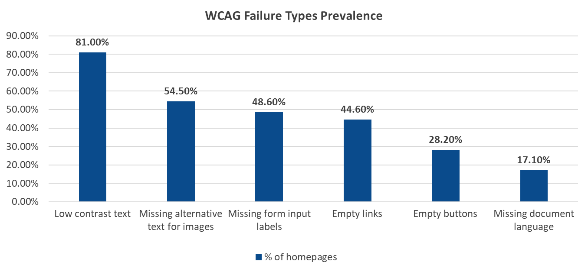

In an increasingly digital world, web accessibility isn't just a nice-to-have, it's a necessity. For six consecutive years, WebAIM, a non-profit with a focus on digital accessibility, has conducted comprehensive evaluations of the top one million websites' home pages. Their [2024 WebAIM Million Project](https://webaim.org/projects/million/) report paints a concerning picture of the current state of web accessibility, while also offering valuable insights into potential improvements.

Note: WebAIM typically publishes the report in February or March, so we should be able to view the 2025 results soon. For the sake of this article, I am using the 2024 report.

## The Current Landscape

The numbers are stark: across one million home pages, researchers detected over 56.7 million distinct accessibility errors—averaging 56.8 errors per homepage. More troubling still, this represents a 13.6% increase from 2023. When we consider that automated testing can only detect approximately 40% of potential Web Content Accessibility Guidelines (WCAG) conformance failures, the actual number of barriers faced by users with disabilities is likely significantly higher.

## The Most Common Barriers

While the scope of accessibility issues might seem overwhelming, the data reveals that 96.4% of detected errors fall into just six categories:

<figure>
    
    <figcaption>WCAG 2.1 Failure Types Prevalence, results via WAVE</figcaption>
</figure>

1.  [Low contrast text](https://www.w3.org/WAI/WCAG22/Understanding/contrast-minimum.html) (81.0% of home pages)
2.  [Missing alternative text for images](https://www.w3.org/WAI/WCAG22/Understanding/non-text-content.html) (54.5%)
3.  [Missing form input labels](https://www.w3.org/WAI/WCAG22/Understanding/labels-or-instructions.html) (48.6%)
4.  [Empty links](https://www.w3.org/WAI/WCAG22/Understanding/link-purpose-in-context.html) (44.6%)
5.  [Empty buttons](https://www.w3.org/WAI/WCAG22/Understanding/non-text-content.html) (28.2%)
6.  [Missing document language](https://www.w3.org/WAI/WCAG22/Understanding/language-of-page.html) (17.1%)

These same issues have persisted as the most common errors for the past five years, suggesting that focusing on these specific areas could dramatically improve web accessibility.

Note: These issues were identified, using WAVE an automated accessibility error detection tool. Automated tools can only identify specific types of WCAG 2.1 failures and it's generally estimated that only \~40% of WCAG 2.1 Success Criteria can be identified via this method. This means that manual testing is imperative to uncovering the full scope of accessibility errors.

## The Real-World Impact

The implications of these accessibility barriers are significant. Studies show that users with disabilities often require more time to complete tasks, face lower success rates, and encounter more "blocking" errors that prevent them from achieving their goals.

How many errors would you tolerate? Errors accounted for 17% of checkout abandonment ([Baymard 2024](https://baymard.com/lists/cart-abandonment-rate)) across all users, and 88% of online consumers are less likely to return to a website if they’ve had a negative experience ([Toptal 2018](https://www.toptal.com/designers/ux/ux-statistics-insights-infographic)).

### How do errors affect people with disabilities?

*   71% of disabled users will abandon a website that they find difficult to use ([Click-Away 2016](https://www.clickawaypound.com/cap16finalreport.html))

*   In an older [Nielsen Norman Group study](https://www.nngroup.com/reports/usability-guidelines-accessible-web-design/), the time on task for assistive technology users was double that of the control group with a 60% lower success rate.

With an average of 56.8 accessibility errors per homepage, that represents a significant hurdle to expect users to overcome.

## A Mixed Picture of Progress

While the overall statistics might seem discouraging, with 95.9% of home pages showing WCAG 2 failures, there are some signs of hope. WebAIM suggests that "pages with fewer errors have gotten better while pages with many errors have gotten worse." This indicates that when organizations prioritize accessibility, they can make meaningful improvements.

Although nearly 96% of homepages had detected WCAG 2.1 failures, just under a third of homepages (31.2%) had 10 or fewer accessibility errors and this number of homepages with fewer errors is growing year over year. What this means is that **a focus on accessibility can make an impact.**

No website is free from error, and there will always be some user experience barriers as users may have conflicting user needs, however a focus on accessibility can eradicate these “low hanging fruit” WCAG failures and free up resources to focus on more complex issues leading to an org "getting beyond compliance" - i.e. being more inclusive and holistic in their approach to accessibility.

## Looking Forward

As websites continue to grow in complexity, the challenge of maintaining accessibility appears to be increasing rather than decreasing. The data suggests that website creators are often asking too much of users with disabilities in terms of overcoming barriers to access. However, the fact that some websites are improving shows that progress is possible when accessibility is made a priority.

### Where to start?

*   **Start small.** Start using an automated tool to detect low hanging fruit accessibility issues.

*   **Skill up.** Get training on incorporating accessibility into your Software Development Lifecyle (SDLC), and learn how to do accessibility testing.

*   **Understand current state.** Get an audit from an experienced professional.

Digital accessibility is a journey and can't be accomplished overnight. Avoid "too good to be true" solutions, as accessibility requires thoughtful implementation. Read the [Overlay Fact Sheet](https://overlayfactsheet.com/en/) for more information.

## Conclusion

The WebAIM Million project reveals both challenges and opportunities in web accessibility. While the current state of accessibility remains problematic, the concentration of issues in a few key areas suggests that targeted improvements could have outsized benefits. By focusing on these common issues and making accessibility a priority from the start, we can work toward a more inclusive web for all users.

The key lesson is clear: accessibility isn't just about compliance—it's about ensuring equal access to digital resources for all users. As the web continues to evolve, making accessibility a fundamental part of web development rather than an afterthought becomes increasingly crucial.
