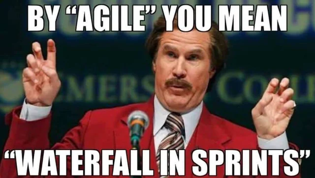
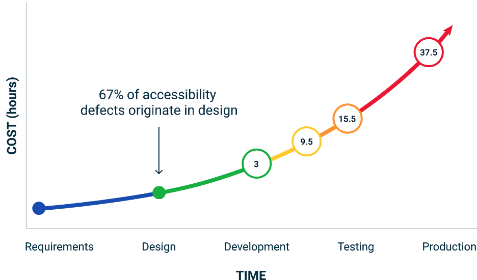

In the digital accessibility industry, a pervasive narrative persists: "If only developers cared more about accessibility...". But this narrative is unfair, and it misrepresents the real problem. Accessibility failures are rarely about individual laziness; they stem from systemic organizational shortcomings. This article examines why blaming developers is counterproductive and proposes a holistic approach to improving digital accessibility across organizations.

## The Agile Illusion: Scrumfall? Wagile?

Many tech companies tout their agile methodologies such as daily stand-ups, sprint planning, iterative design - it all sounds great, but the reality often feels like waterfall projects timeboxed to two-week sprints. This "Scrumfall" approach combines the sequential phases of waterfall with the time constraints of Scrum, without embracing true agile collaboration. We're still in linear product development, with engineers at the end of the process. This approach leads to compressed timelines, more bureaucracy, and lack of collaboration, where it's easy to point the finger at the last person to touch the product when things go wrong.

When it comes to accessibility, these "Wagile" processes break down even further. Product requirements may include vague accessibility stories like "As a user, I want WCAG 2.1 AA compliance." Designs may be finalized without accessibility annotations or clear communication of intent.

Imagine being a developer in this scenario. You're the last link in a chain where accessibility was an afterthought or wasn't properly planned for, and now, you're tasked with retrofitting accessibility into a nearly complete product.

What appears as "resistance" or "laziness" is often just the inevitable result of a broken process.

## Collective Responsibility: Setting the Stage for Systemic Solutions

While developers often bear the brunt of accessibility criticisms, it's crucial to understand that accessibility shortfalls occur across the entire product development lifecycle. According to research from DeQue, a staggering [67% of accessibility defects originate in the design phase](https://www.deque.com/blog/is-closing-the-web-accessibility-design-development-gap-a-bridge-too-far/#:~:text=But%2067%25%20of%20accessibility%20issues,do%20we%20cross%20that%20chasm?) - long before developers write a single line of code.

<figure>

<figcaption>DeQue case study indicating that the bulk of accessibility defects originate in design.</figcaption>
</figure>

To truly understand the accessibility challenge, we must acknowledge the role-specific failures that contribute to systemic barriers:

*   **Incomplete User Stories:** A product manager may write a user story like "As a user, I want to filter results," with no mention of keyboard navigation or screen reader compatibility. Accessibility may not be included as a core and specific requirement.

*   **Design Gaps:** A designer might create a visually appealing custom dropdown but overlook essential accessibility features like focus states and ARIA attributes. Accessibility is not consistently factored into the design process.

*   **Developer Guesswork:** Consequently, developers are left to guess about accessibility requirements. Should the dropdown announce selections? Should filter actions trigger screen reader notifications? This inconsistency forces developers into a no-win situation.

The cumulative result is a product that excludes users with disabilities.

As accessibility specialists, we often say, "accessibility is a team effort." This means we must move beyond individual blame and recognize that accessibility failures are often systemic, requiring collective solutions. By understanding how each role contributes to the problem, we can begin to implement the strategic interventions needed to transform our approach to accessibility.

### Shifting from Reactive to Proactive Approaches

Most organizations remain frustratingly reactive when addressing accessibility, identifying and fixing issues only after development is underway, or worse, after product launch. The cost of this reactive approach is significant. What might have been a simple design adjustment becomes an expensive, time-consuming retrofit. Read Karl Grove's [Understanding the cost of not being accessible](https://karlgroves.com/understanding-the-cost-of-not-being-accessible/), which takes a stab at breaking down the costs and ROI of accessibility.

A strategic approach involves integrating accessibility expertise throughout the entire development lifecycle, from leadership decisioning to implementation. Organizations that prioritize accessibility establish consistent practices across all roles, with accessibility experts guiding the process:

*   **Explicit Accessibility Requirements:** Product managers should embed accessibility requirements directly into user stories, such as: "As a keyboard-only user, I need to navigate through search filters using standard keyboard controls" or "As a screen reader user, I need to be notified when search results update."

*   **Comprehensive Design Specifications:** Designers should provide detailed specifications that communicate intent and consistently include focus states, content structure, ARIA roles, expected screen reader announcements, and keyboard interaction patterns.

*   **Strategic Knowledge Dissemination:** Rather than focusing solely on developer training, accessibility knowledge should be strategically distributed throughout the organization. This means providing specialized guidance tailored to each role's needs, empowering everyone to contribute to inclusive outcomes.

*   **Incentive Alignment:** Working with leadership, accessibility experts can help ensure that accessibility achievements are recognized and rewarded with the same enthusiasm as other technical accomplishments. This means incorporating accessibility metrics into performance reviews and celebrating successes across the organization.

When accessibility considerations are consistently integrated at every stage of development, and when accessibility experts act as allies and strategic partners rather than solely as "reviewers", organizations can effectively transform the "lazy developer" narrative into one of shared responsibility and collective success. This proactive approach drives lasting cultural change, making accessibility a core value and not an afterthought.

### Tackling the whole problem

Implementing collective responsibility when we encounter an accessibility issue, rather than asking "why didn't the developer fix this?", we should examine the entire process that produced the failure.

Consider a common accessibility issue: a heading that isn't properly marked up in HTML. Instead of placing blame, trace the journey:

*   **Process Examination:** Was the heading structure clearly documented in requirements? Did designers annotate their mockups to indicate heading levels? Was there a design walkthrough where this was discussed?

*   **Knowledge Assessment:** Do team members across disciplines understand why proper heading structure matters? Does everyone have access to accessibility guidelines and training?

*   **Procedural Integration:** Does the Definition of Ready include accessibility requirements? Does the Definition of Done include accessibility testing? Are there checkpoints throughout development where accessibility is verified?

*   **Cultural Evaluation:** Does leadership emphasize the importance of accessibility? Is time explicitly allocated for accessibility implementation?

When a component fails accessibility testing, the problem rarely begins and ends with developer implementation. By examining these broader questions, we can identify systemic breakdowns and address the root causes rather than symptoms.

### Moving Forward: From Blame to Collaboration

Shifting our perspective from blame to collaboration isn't just a mindset shift, but the key to lasting accessibility change. Organizations must move beyond pointing fingers and start integrating accessibility into every phase of development. The question isn't "Why didn't the developer fix this?" but rather, "How can we prevent these failures in the first place?"

When organizations embrace collective responsibility for accessibility, they not only create more inclusive products but also improve their overall development processes in several key ways:

*   **Increased team knowledge:** When accessibility becomes everyone's responsibility, team members naturally develop a broader understanding of inclusive design principles that benefit all aspects of product development.

*   **Faster problem-solving:** As accessibility knowledge spreads throughout the team, identifying and fixing issues becomes more efficient. Problems that once required specialist intervention can be addressed directly by team members who encounter them.

*   **Enhanced collaboration:** A shared commitment to accessibility naturally fosters better communication and teamwork across disciplines, breaking down the silos that often lead to accessibility failures in the first place.

The path to truly accessible products begins by dismantling the "lazy developer" myth and cultivating a culture of collective responsibility. Because when accessibility becomes everyone's responsibility, we transform not just our products, but our entire approach to digital innovation and inclusion.
